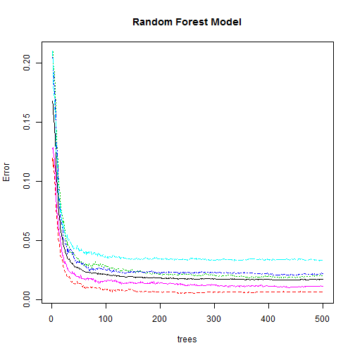

The goal of this assignment is to build a machine learning algorithm identifying types of weight lifting exercises based off data gathered from a number of sensors. More information can be found [here](http://groupware.les.inf.puc-rio.br/har).


I'll start by loading the data then taking a look at the dimensions.


```
## [1] 19622   160
```

Now I'll take a look at how much missing data I may have to deal with, given some of the variables are summary columns of multiple records.


```r
colSums(is.na(train))/nrow(train)
```

```
##                        X                user_name     raw_timestamp_part_1 
##                   0.0000                   0.0000                   0.0000 
##     raw_timestamp_part_2           cvtd_timestamp               new_window 
##                   0.0000                   0.0000                   0.0000 
##               num_window                roll_belt               pitch_belt 
##                   0.0000                   0.0000                   0.0000 
##                 yaw_belt         total_accel_belt       kurtosis_roll_belt 
##                   0.0000                   0.0000                   0.0000 
##      kurtosis_picth_belt        kurtosis_yaw_belt       skewness_roll_belt 
##                   0.0000                   0.0000                   0.0000 
##     skewness_roll_belt.1        skewness_yaw_belt            max_roll_belt 
##                   0.0000                   0.0000                   0.9793 
##           max_picth_belt             max_yaw_belt            min_roll_belt 
##                   0.9793                   0.0000                   0.9793 
##           min_pitch_belt             min_yaw_belt      amplitude_roll_belt 
##                   0.9793                   0.0000                   0.9793 
##     amplitude_pitch_belt       amplitude_yaw_belt     var_total_accel_belt 
##                   0.9793                   0.0000                   0.9793 
##            avg_roll_belt         stddev_roll_belt            var_roll_belt 
##                   0.9793                   0.9793                   0.9793 
##           avg_pitch_belt        stddev_pitch_belt           var_pitch_belt 
##                   0.9793                   0.9793                   0.9793 
##             avg_yaw_belt          stddev_yaw_belt             var_yaw_belt 
##                   0.9793                   0.9793                   0.9793 
##             gyros_belt_x             gyros_belt_y             gyros_belt_z 
##                   0.0000                   0.0000                   0.0000 
##             accel_belt_x             accel_belt_y             accel_belt_z 
##                   0.0000                   0.0000                   0.0000 
##            magnet_belt_x            magnet_belt_y            magnet_belt_z 
##                   0.0000                   0.0000                   0.0000 
##                 roll_arm                pitch_arm                  yaw_arm 
##                   0.0000                   0.0000                   0.0000 
##          total_accel_arm            var_accel_arm             avg_roll_arm 
##                   0.0000                   0.9793                   0.9793 
##          stddev_roll_arm             var_roll_arm            avg_pitch_arm 
##                   0.9793                   0.9793                   0.9793 
##         stddev_pitch_arm            var_pitch_arm              avg_yaw_arm 
##                   0.9793                   0.9793                   0.9793 
##           stddev_yaw_arm              var_yaw_arm              gyros_arm_x 
##                   0.9793                   0.9793                   0.0000 
##              gyros_arm_y              gyros_arm_z              accel_arm_x 
##                   0.0000                   0.0000                   0.0000 
##              accel_arm_y              accel_arm_z             magnet_arm_x 
##                   0.0000                   0.0000                   0.0000 
##             magnet_arm_y             magnet_arm_z        kurtosis_roll_arm 
##                   0.0000                   0.0000                   0.0000 
##       kurtosis_picth_arm         kurtosis_yaw_arm        skewness_roll_arm 
##                   0.0000                   0.0000                   0.0000 
##       skewness_pitch_arm         skewness_yaw_arm             max_roll_arm 
##                   0.0000                   0.0000                   0.9793 
##            max_picth_arm              max_yaw_arm             min_roll_arm 
##                   0.9793                   0.9793                   0.9793 
##            min_pitch_arm              min_yaw_arm       amplitude_roll_arm 
##                   0.9793                   0.9793                   0.9793 
##      amplitude_pitch_arm        amplitude_yaw_arm            roll_dumbbell 
##                   0.9793                   0.9793                   0.0000 
##           pitch_dumbbell             yaw_dumbbell   kurtosis_roll_dumbbell 
##                   0.0000                   0.0000                   0.0000 
##  kurtosis_picth_dumbbell    kurtosis_yaw_dumbbell   skewness_roll_dumbbell 
##                   0.0000                   0.0000                   0.0000 
##  skewness_pitch_dumbbell    skewness_yaw_dumbbell        max_roll_dumbbell 
##                   0.0000                   0.0000                   0.9793 
##       max_picth_dumbbell         max_yaw_dumbbell        min_roll_dumbbell 
##                   0.9793                   0.0000                   0.9793 
##       min_pitch_dumbbell         min_yaw_dumbbell  amplitude_roll_dumbbell 
##                   0.9793                   0.0000                   0.9793 
## amplitude_pitch_dumbbell   amplitude_yaw_dumbbell     total_accel_dumbbell 
##                   0.9793                   0.0000                   0.0000 
##       var_accel_dumbbell        avg_roll_dumbbell     stddev_roll_dumbbell 
##                   0.9793                   0.9793                   0.9793 
##        var_roll_dumbbell       avg_pitch_dumbbell    stddev_pitch_dumbbell 
##                   0.9793                   0.9793                   0.9793 
##       var_pitch_dumbbell         avg_yaw_dumbbell      stddev_yaw_dumbbell 
##                   0.9793                   0.9793                   0.9793 
##         var_yaw_dumbbell         gyros_dumbbell_x         gyros_dumbbell_y 
##                   0.9793                   0.0000                   0.0000 
##         gyros_dumbbell_z         accel_dumbbell_x         accel_dumbbell_y 
##                   0.0000                   0.0000                   0.0000 
##         accel_dumbbell_z        magnet_dumbbell_x        magnet_dumbbell_y 
##                   0.0000                   0.0000                   0.0000 
##        magnet_dumbbell_z             roll_forearm            pitch_forearm 
##                   0.0000                   0.0000                   0.0000 
##              yaw_forearm    kurtosis_roll_forearm   kurtosis_picth_forearm 
##                   0.0000                   0.0000                   0.0000 
##     kurtosis_yaw_forearm    skewness_roll_forearm   skewness_pitch_forearm 
##                   0.0000                   0.0000                   0.0000 
##     skewness_yaw_forearm         max_roll_forearm        max_picth_forearm 
##                   0.0000                   0.9793                   0.9793 
##          max_yaw_forearm         min_roll_forearm        min_pitch_forearm 
##                   0.0000                   0.9793                   0.9793 
##          min_yaw_forearm   amplitude_roll_forearm  amplitude_pitch_forearm 
##                   0.0000                   0.9793                   0.9793 
##    amplitude_yaw_forearm      total_accel_forearm        var_accel_forearm 
##                   0.0000                   0.0000                   0.9793 
##         avg_roll_forearm      stddev_roll_forearm         var_roll_forearm 
##                   0.9793                   0.9793                   0.9793 
##        avg_pitch_forearm     stddev_pitch_forearm        var_pitch_forearm 
##                   0.9793                   0.9793                   0.9793 
##          avg_yaw_forearm       stddev_yaw_forearm          var_yaw_forearm 
##                   0.9793                   0.9793                   0.9793 
##          gyros_forearm_x          gyros_forearm_y          gyros_forearm_z 
##                   0.0000                   0.0000                   0.0000 
##          accel_forearm_x          accel_forearm_y          accel_forearm_z 
##                   0.0000                   0.0000                   0.0000 
##         magnet_forearm_x         magnet_forearm_y         magnet_forearm_z 
##                   0.0000                   0.0000                   0.0000 
##                   classe 
##                   0.0000
```

Now I'll remove the columns that will not add anything to the model (general identification data, categorical info, summary columns etc.) and convert the remaining columns to numeric so I can run principal components.


```r
new.train <-train[,-7:-1]
new.train[new.train == "#DIV/0!"] <- NA
new.train[new.train == ""] <- NA
new.train <- new.train[,colSums(is.na(new.train))/nrow(new.train) < 0.9]

convert.magic <- function(obj,types){
  out <- lapply(1:length(obj),FUN = function(i){FUN1 <- switch(types[i],character = as.character,numeric = as.numeric,factor = as.factor); FUN1(obj[,i])})
  names(out) <- colnames(obj)
  as.data.frame(out)
}

new.train <- convert.magic(new.train,c(rep("numeric",ncol(new.train)-1),"factor"))
```

Now I'll run principal components to reduce the potential variables while maintaining much of the variance.


```r
preProc <- preProcess(new.train[,-ncol(new.train)],method="pca",thresh = .90)
new.train.PCA <- predict(preProc,new.train[,-ncol(new.train)])
```

Binding the principal components values to the "classe" variable.


```r
new.train <- cbind(new.train.PCA,new.train$classe)
names(new.train) <- c(names(new.train.PCA),"classe")
```

Now building a random forest model on the training data.


```r
model <- randomForest(classe ~ .,data=new.train)
model
```

```
## 
## Call:
##  randomForest(formula = classe ~ ., data = new.train) 
##                Type of random forest: classification
##                      Number of trees: 500
## No. of variables tried at each split: 4
## 
##         OOB estimate of  error rate: 1.73%
## Confusion matrix:
##      A    B    C    D    E class.error
## A 5542   15   16    3    4     0.00681
## B   40 3720   30    1    6     0.02028
## C    9   35 3346   26    6     0.02221
## D    5    2   96 3109    4     0.03327
## E    3    9   16   14 3565     0.01164
```

```r
plot(model,main="Random Forest Model")
```

 

Note that the estimated OOB error rate is ***1.8%***, meaning the estimated accurracy is ***98.2%***.

Now preparing the test data set for predictions.


```r
test <- read.csv("pml-testing.csv",colClasses="character")
new.test <-test[,c(-7:-1,-ncol(test))]
new.test[new.test == "#DIV/0!"] <- NA
new.test[new.test == ""] <- NA

new.test <- new.test[,colSums(is.na(new.test))/nrow(new.test) < 0.9]

new.test <- convert.magic(new.test,c(rep("numeric",ncol(new.test))))

new.test.PCA <- predict(preProc,new.test)
```

Compiling predicted values.


```r
pv <- predict(model,newdata = new.test.PCA)
```

Preparing files for submission.


```r
pml_write_files = function(x){
  n = length(x)
  for(i in 1:n){
    filename = paste0("problem_id_",i,".txt")
    write.table(x[i],file=filename,quote=FALSE,row.names=FALSE,col.names=FALSE)
  }
}

pml_write_files(pv)
```
